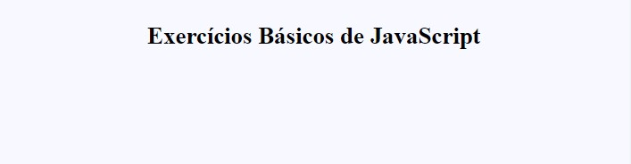

<h1 align="center"> Explorer - Intensivão Explorer Sem Limites</h1>

Projeto para a formação Fullstack da Rocketseat para ensino de tecnologias WEB.  
<a href="https://www.rocketseat.com.br/formacao/fullstack?utm_source=github&utm_medium=explorer-projeto-intensivao-js-02&utm_campaign=capture-explorer&utm_term=organic&utm_content=descricao-github-rogeriolins">Faça essa formação em vídeo clicando aqui.</a>

  <a href="#-tecnologias">Tecnologias</a>&nbsp;&nbsp;&nbsp;|&nbsp;&nbsp;&nbsp;
  <a href="#-projeto">Projeto</a>&nbsp;&nbsp;&nbsp;|&nbsp;&nbsp;&nbsp;
  <a href="#-layout">Layout</a>&nbsp;&nbsp;&nbsp;|&nbsp;&nbsp;&nbsp;
  <a href="#memo-licença">Licença</a>

  

 

  

## 🚀 Tecnologias

Esse projeto foi desenvolvido com as seguintes tecnologias:

- HTML e CSS
- Git e Github
- JavaScript

## 💻 Projeto

O Desafio de JS - Proposto 02 - tem as seguintes finalidades:

Você pode apresentar o resultado tanto no **console** quanto em um **alerta** no navegador.

1. Crie um script que exiba a mensagem "Hello World!" em um alerta no navegador.

2. Crie um script que declare duas variáveis e exiba o resultado da soma entre elas.

3. Crie um script que declare uma variável e verifique se o seu valor é um número. Se for, exiba a mensagem "É um número", caso contrário, exiba a mensagem "Não é um número".
4. Crie um script que declare uma variável e verifique se o seu valor é uma string. Se for, exiba a mensagem "É uma string", caso contrário, exiba a mensagem "Não é uma string".

5. Crie um script que declare uma variável e verifique se o seu valor é um booleano. Se for, exiba a mensagem "É um booleano", caso contrário, exiba a mensagem "Não é um booleano".

6. Crie um script que declare duas variáveis e exiba o resultado da subtração entre elas.

7. Crie um script que declare duas variáveis e exiba o resultado da multiplicação entre elas.

8. Crie um script que declare duas variáveis e exiba o resultado da divisão entre elas.

9. Crie um script que declare uma variável e verifique se o seu valor é um número par. Se for, exiba a mensagem "É um número par", caso contrário, exiba a mensagem "Não é um número par".

10. Crie um script que declare uma variável e verifique se o seu valor é um número ímpar. Se for, exiba a mensagem "É um número ímpar", caso contrário, exiba a mensagem "Não é um número ímpar".

- [Acesse o projeto finalizado, online](https://rogeriolins.github.io/projeto09-intensivao-js)

- [Assistir aulas](https://www.rocketseat.com.br/formacao/fullstack?utm_source=github&utm_medium=explorer-projeto-intensivao-js-02&utm_campaign=capture-explorer&utm_term=organic&utm_content=descricao-github-rogeriolins)

## 🔖 Layout

Você pode visualizar o projeto ao se matricular na formação.

## :memo: Licença

Esse projeto está sob a licença MIT.

---

Feito com ♥ by Rocketseat e codado por [Rogerio Lins](https://instagram.com/rogeriolins.dev) :wave: [Participe da nossa comunidade!](https://discord.gg/rocketseat)
